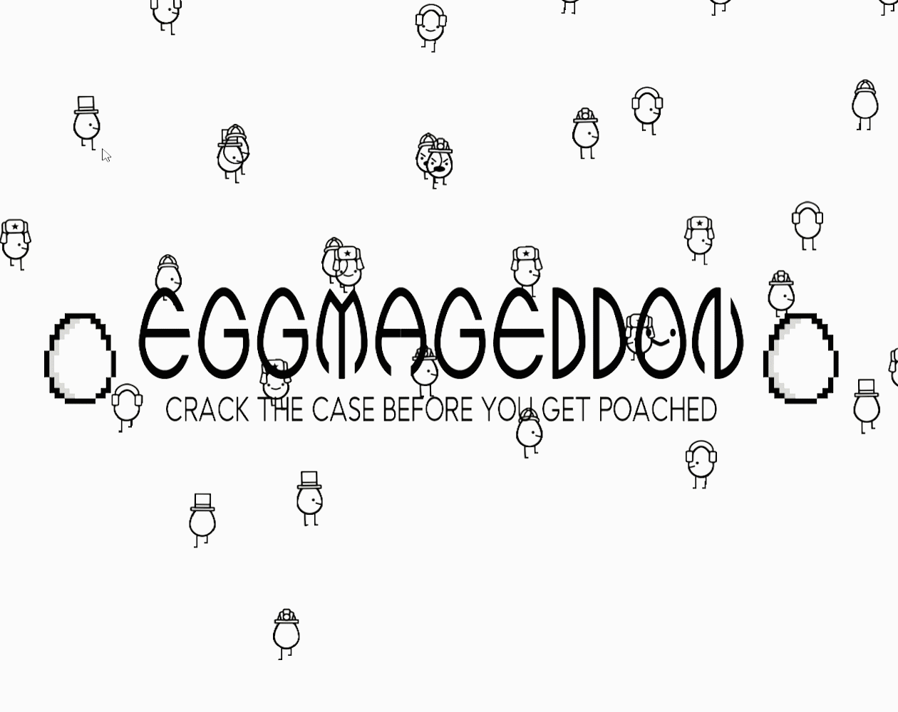
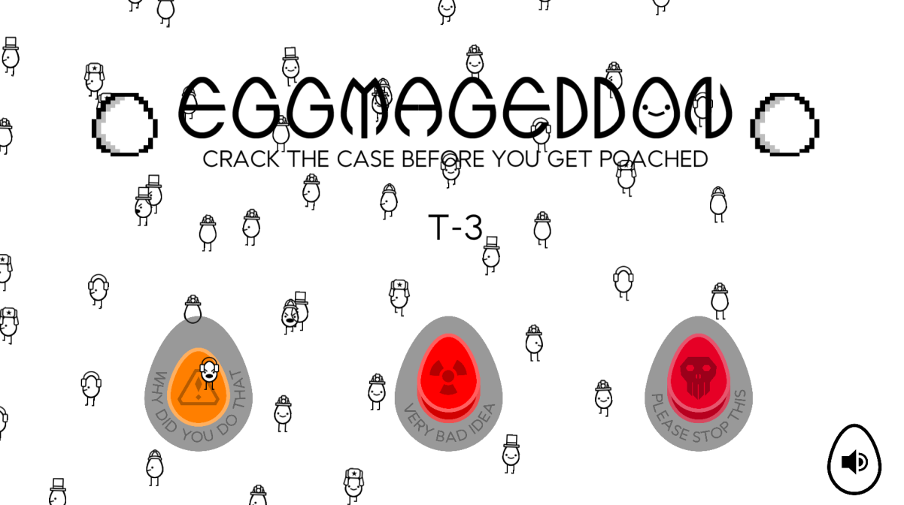
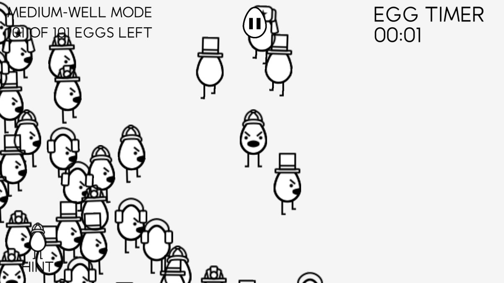
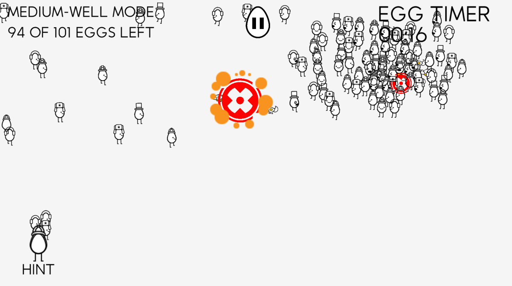
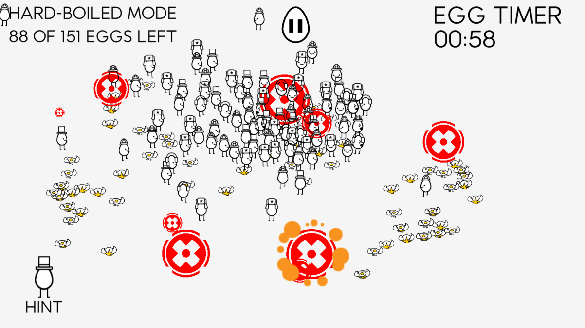
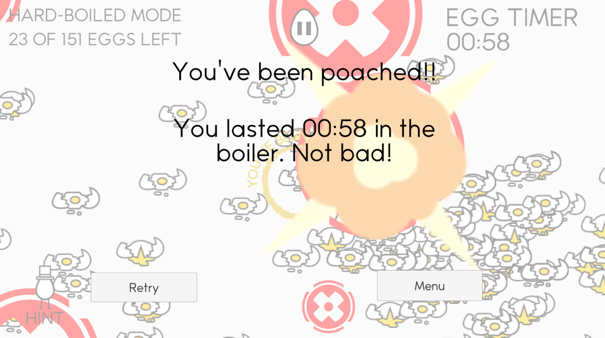

# Eggmageddon

### https://epicrider.itch.io/eggmageddon

Eggmageddon is a game about deducing which dapper little egg among the masses is yours to control, while trying to avoid being poached in an onslaught of randomized missile strikes. Details like your egg's accessories and movement patterns can help distinguish them from the others, but beware: your fellow eggs don't like to be pushed around, and the crowd is a very difficult obstacle to cross. It's like a scavenger hunt, but with several more unbearable egg puns and significantly more stressful. 

Eggmageddon was made in 48 hours by Trisagion Games, for GMTK Jam 2020!

## Controls
WASD to move.

That's about it! Good luck trying to find out which egg you are :)

## Credits
 - Ben Cuan ([64bitpandas](https://github.com/64bitpandas)) - Code, Sound, Music
 - Kevin Chu ([xKindredKinesis](https://github.com/KindredKinesis)) - Graphic Design, Art
 - Omar Hossain ([Epicrider](https://github.com/Epicrider)) - Code
 - Eric Qian ([EnumC](https://github.com/EnumC)) - Code
 - Akhilan Ganesh ([akhilanganesh](https://github.com/akhilanganesh)) - Code
 - Kapilan Ganesh ([kapilanganesh](https://github.com/kapilanganesh)) - Code, Playtesting

## Screenshots

